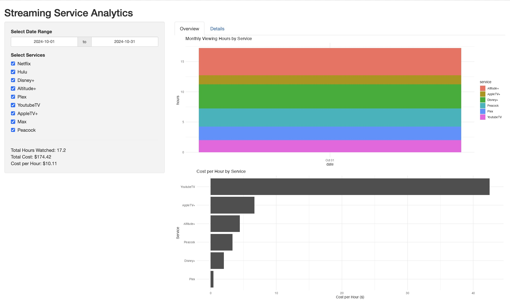

# TV Watch-Log

## Description

This is a simple app that provides a terminal interface for logging TV shows that you have watched, along with a Shiny
app for visualizing the utilization of various streaming services.



## Requirements

In addition to R and Go and their respective dependencies, you will also need to set up a `.env` file in the root of the
project with the following variables:

```
# .env
OPENAI_API_KEY={your-openai-api-key}
TVDB_TOKEN={your-tvdb-token}
```

## How to Run

### The Terminal UI for Logging TV Shows
To run the terminal app, simply run the following command:

```bash
just run-chat
```

Then, enter brief descriptions of the content which you watched, and the app will attempt to log it for you. The input
should include the name of the show or content, how long you spent watching it, and when you watched it (relative to
today). If the content is unique to a specific streaming service, the app should automatically detect that and log it
correctly. Data should immediately appear in the Shiny app if it is running.

When you are finished inputting data, enter `q` to quit the app.

Here is some example input and output:

```bash
➜ just run-chat
go run .
Conversation
---------------------
> I just watched a 45 minute episode of Agatha All Along.
2024/10/31 14:59:12 INFO Tool called function_name=get_show_info
2024/10/31 14:59:12 INFO Tool call arguments args="{Query:Agatha All Along}"
2024/10/31 14:59:12 INFO Getting show info query="Agatha All Along"
2024/10/31 14:59:12 INFO Queried TVDB results=1
2024/10/31 14:59:12 INFO Got show info info="{Title:Agatha All Along Service:Disney+}"
2024/10/31 14:59:14 INFO Processing message message="[\n    {\n        \"days_offset\": 0,\n        \"service\": \"Disney+\",\n        \"title\": \"Agatha All Along\",\n        \"watch_time\": 45\n    }\n]"
2024/10/31 14:59:14 INFO Wrote row to file
Updated file with new data
> Five days ago, I watched an hour of Friends on Plex.
2024/10/31 14:59:45 INFO Tool called function_name=get_show_info
2024/10/31 14:59:45 INFO Tool call arguments args={Query:Friends}
2024/10/31 14:59:45 INFO Getting show info query=Friends
2024/10/31 14:59:45 INFO Queried TVDB results=50
2024/10/31 14:59:45 INFO Got show info info="{Title:Friends Service:NBC}"
2024/10/31 14:59:47 INFO Processing message message="[\n    {\n        \"days_offset\": -5,\n        \"service\": \"Plex\",\n        \"title\": \"Friends\",\n        \"watch_time\": 60\n    }\n]"
2024/10/31 14:59:47 INFO Wrote row to file
Updated file with new data
> q
```

### The Shiny App for Visualizing Streaming Service Utilization

To run the Shiny app, just run the following command:

```bash
just run-shiny
```

